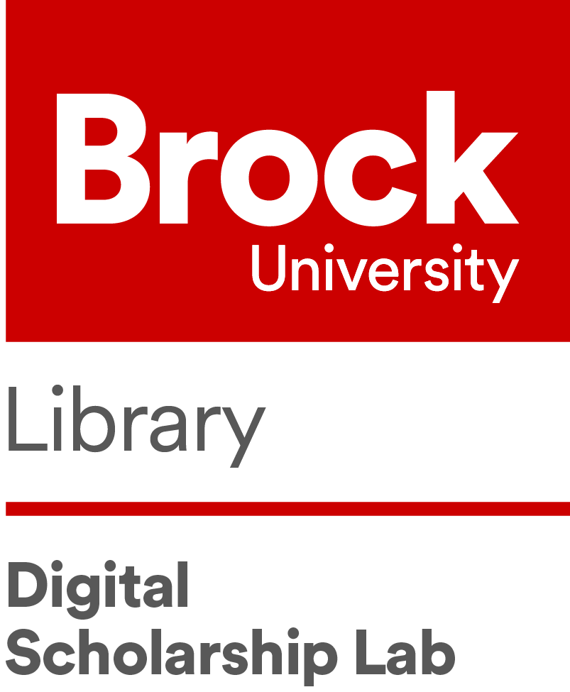

[@brock_dsl](https://twitter.com/brock_dsl)

# Introduction to Python 

In this workshop we'll be learning about the basics of the Python programming language. If we have time we'll look at a simple Text Analysis activity. Feel free to move through the tutorial faster if you like.

## Handout

A handout with a description of what is covered in the session can be found [here](https://brockdsl.github.io/Intro_to_Python_Workshop/intro_python.pdf)

## Getting Started

You will need a Google Account to participate in this workshop. Click on the link following to begin:

 - Introduction Excercise

